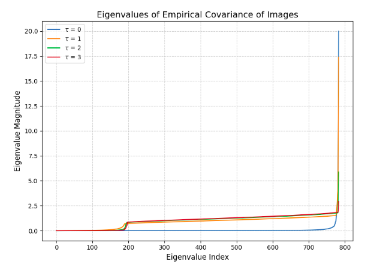
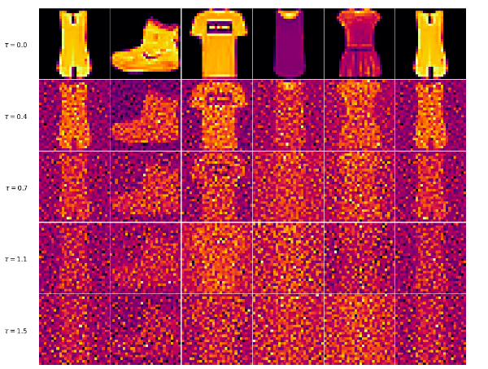
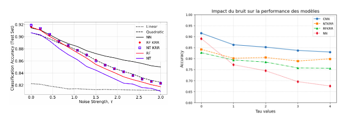

# When Do Neural Networks Outperform Kernel Methods?

## Overview

We reproduce and extend Ghorbani et al. [1] by comparing NTKRR, RFKRR, MLP‐NN, and a CNN under a Spiked Covariate Model (SCM) on FMNIST and MNIST. By injecting controlled high‐frequency (HF) noise via a DCT‐based filter, we measure accuracy degradation and track covariance eigenvalue spectra. Our results show that kernel methods degrade sharply with HF noise, MLPs require extensive training, and CNNs remain most robust.

A detailed report including theoretical background and extended results is available [here](https://github.com/MariusDragic/NeuralVSKernel/blob/main/NeuralVSKernel_report.pdf) for interested readers.


## Spiked Covariate Model (SCM)

Each datapoint $x\in\mathbb{R}^d$ is generated as
```math
  x = U\,z_0 + U_{\perp}\,z_1,\quad
  z_0\sim\mathcal{N}(0,\,r_1 I),\;z_1\sim\mathcal{N}(0,\,r_2 I)
```

where $U\in\mathbb{R}^{d\times d_0}$, $d_0\ll d$. Labels depend only on $U^\top x$.  
High‐frequency noise is added in DCT space as
```math
  \widetilde{x}_{\rm noisy} 
  = \widetilde{x} + \tau \,\frac{\|\widetilde{x}\|}{\|Z\circ F\|}\,(Z\circ F),
```

where $F$ masks high‐frequency coefficients, $\tau$ controls noise amplitude, and $Z\sim\mathcal{N}(0, I)$. Inverse DCT + normalization returns the noisy image.

<p align="center">
  
</p>
<p align="center">
  <b>Figure 1 – FMNIST covariance eigenvalues flatten as tau increases, confirming isotropic HF noise.</b>
</p>

<p align="center">
  
</p>

<p align="center">
  <b>Figure 2 – FMNIST samples corrupted by increasing high-frequency noise levels (τ).</b>
</p>

As τ increases from 0.0 to 1.5, visual structures are progressively destroyed, illustrating the effect of isotropic perturbations on image space.
## Methods

1. **NTKRR & RFKRR**  
   - NTKRR uses the exact Neural Tangent Kernel of an MLP.  
   - RFKRR approximates the same kernel via random features.  
   - Regularization $\lambda=10^{-3}$.

2. **MLP‐NN & CNN**  
   - MLP‐NN: fully connected layers (e.g. `[512,256,128]`), ReLU, optional dropout.  
   - CNN: two convolutional blocks (conv→ReLU→pool), followed by a dense classifier.  
   - Trained with Adam (lr=1e-3) or SGD, batch size 256, epochs 20 (100 for $\tau=0$ baseline).  

3. **Data & Preprocessing**  
   - FMNIST, MNIST (28×28), vectorized to $d=784$.  
   - Four noise levels $\tau\in\{0,1,3,5\}$.  
   - All images normalized to $\|\cdot\| = \sqrt{d}$.

## Experimental Results

Test accuracies (averaged over 5 seeds) on FMNIST:

| Method   | $\tau=0$   | $\tau=1$   | $\tau=3$   | $\tau=5$   |
|----------|------------|------------|------------|------------|
| NTKRR    | 0.8915     | 0.7842     | 0.6730     | 0.5404     |
| RFKRR    | 0.8872     | 0.7769     | 0.6615     | 0.5332     |
| MLP‐NN   | 0.8922     | 0.7674     | 0.6842     | 0.6028     |
| **CNN**  | **0.9053** | **0.8018** | **0.7225** | **0.6157** |

- **No noise $\tau=0$**: All methods ≈89–90 % accuracy; CNN leads at 90.5 %.  
- **Moderate noise $\tau=1$**: Kernels drop to ~78 %, MLP to ~77 %, CNN retains ~80 %.  
- **High noise $\tau=3,5$**: Kernels fall below 54 %; MLP at 60 %; CNN remains best at 62 %.

<p align="center">
  
</p>
<p align="center">
<b>Figure 3 – FMNIST accuracy under HF noise for NTKRR, RFKRR, MLP, and CNN.</b>
</p>

## Authors

- **Marius Dragic** — [@MariusDragic](https://github.com/MariusDragic)  
- **Alexis Chatail-Rigolleau** — [@6racuse](https://github.com/6racuse)

If you use this work or code in your research, please consider citing the project report:
> M. Dragic, A. Chatail-Rigolleau. *When Do Neural Networks Outperform Kernel Methods?* CentraleSupélec TDL Project Report, 2025. [PDF](https://github.com/MariusDragic/NeuralVSKernel/blob/main/NeuralVSKernel_report.pdf)
